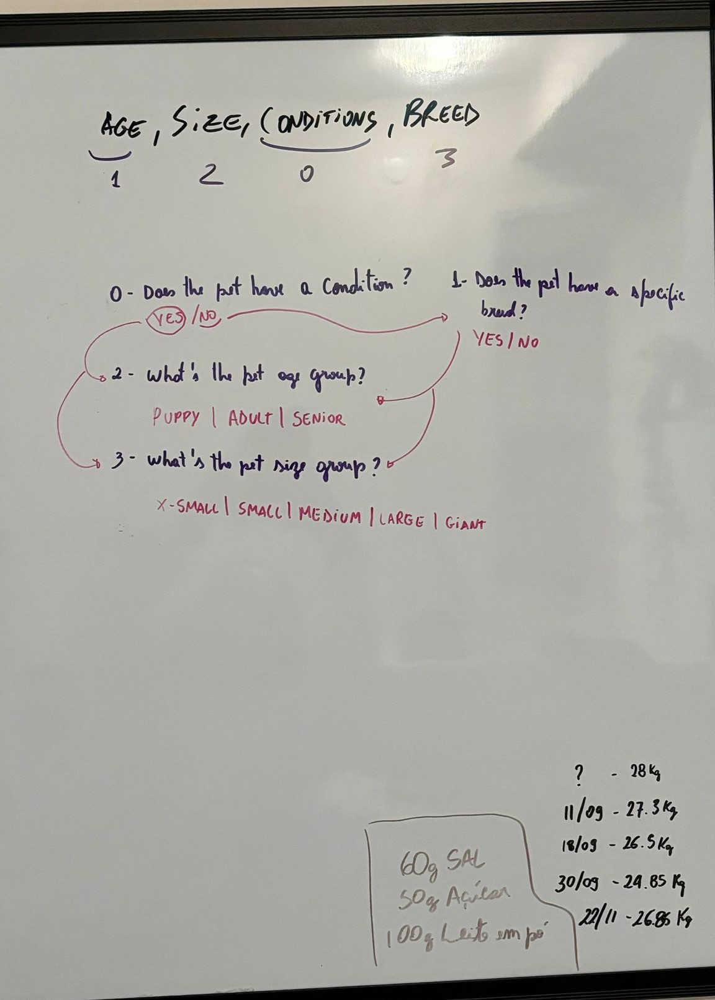
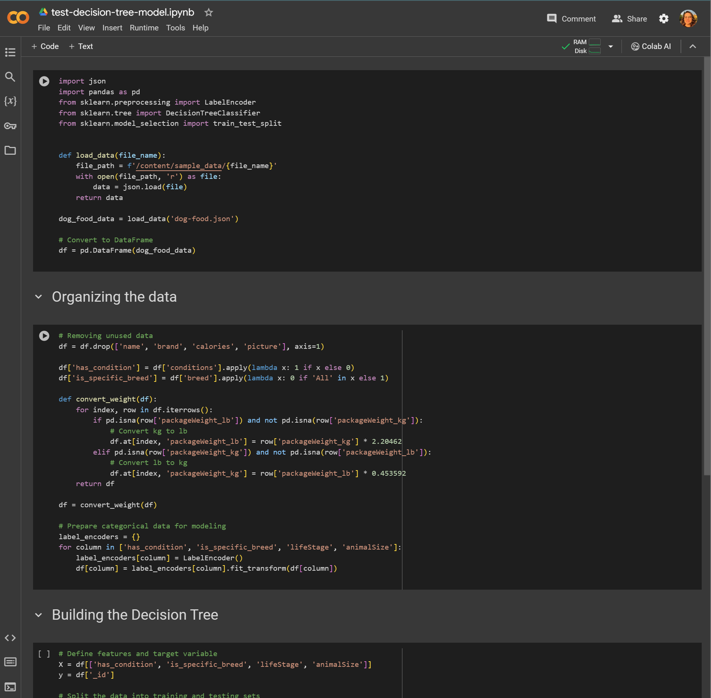

# Ideation Process

## The idea

I proposed me this challenge motivated by Vetster's job oppportunity as a Frontend Engineer. Then, I started to think about the kind of features pet owners would like to have at Vetster's website. This ideation process was backed up by about my own experience as a pet owner and its difficulties; and how Vetster could help me and others alike.

Finally, I decided to go for something related with food. I drew some sketches on the iPad, because I love to reprensenting ideas in a more organized and visual way, like drawing in the whiteboard, making presentations, using pen and paper, etc.


## Research

When I realized the feature would be related to food, I started to research about Vetster's platform and what kind of information they already have on pets and the technologies they use on the website. More details were captured using the browser's inspecting tool.

As I had a base knowledge of how animal feeding process works, because I studied it for Lola's new diet, I didn't need to research much about it. I just needed to get some support materials like a [table of calories per food type/brand](https://www.franklinanimalclinic.vet/sites/site-2382/documents/Dog_Dry_Foods1.pdf) and a list of health conditions that could be used in the feature.

## Design

I started to design the flow in Whimsical, a simple and practical tool that I love to use to design workflows and wireframes. I used Vetsert's website screenshots to guide me in the design process, as I wanted to keep it in the same style and colors.


## Development

### Frontend

I started by structuring and setting up the project and installing the dependencies. I used Vue3, Vue Router, Vite, Pinia, VitePress, TailwindCSS, Heroicons and Firebase Hosting, you can check more details in the [Technology Stack](/project-scope.md#technology-stack) section.

With a defined project structure, I started working on the general layout, the sidebar, main menu, and the area where the routes are rendered. I wanted to keep it as real as possible in terms of the working process, so I used a github repository for versioning, commiting and pushing the code as I worked on it. [You can check the project's commit history here](https://github.com/clarabatt/pet-food-advice/commits/main/). I even created workflows to deploy the application on Firebase and branches and pull requests to control and organize the code.

I realized that I had to reduce the scope and focus on one species of pet as MVP, **dogs**. I also decided on not delivering features like login, signup, and pet creation.

The next phase was to create the feature UI itself, at least for the first parts of the flow, the pet selection and the health conditions selection. I created the components and the routes for these two, and the global state management with Pinia, which I was pretty happy with.

> By the way, I loved to use Vue3. I'm thinking about using it in my next projects, instead of React.
> Pinia is very close to MobX on React, and I love to use it because it keeps things simple.

### Data and Decision Tree

I started to work on the logic of the feature, the decision tree. I created a JSON file with the dog food samples:

```json
{
  "_id": "001",
  "name": "Royal Canin® Breed Health Nutrition® Golden Retriever Puppy Dry Dog Food",
  "brand": "Royal Canin",
  "condition": null,
  "packageWeight_kg": 13.6,
  "packageWeight_lb": null,
  "price": 122.99,
  "calories": 447,
  "breed": "Golden Retriever",
  "animalSize": "All",
  "lifeStage": "Puppy",
  "picture": "https://s7d2.scene7.com/is/image/PetSmart/5184508?$CLEARjpg$"
}
```

I got those samples from [PetSmart's website](https://www.petsmart.ca/dog/food/dry-food/authority+blue-buffalo+hills-science-diet+natural-balance+nutrience+purina-pro-plan+royal-canin/?pmin=0.01&srule=best-sellers), and made some adjusts for my use. Thank you, PetSmart <3.

The decision tree was a part that required some tests. I drew the questions in my white board to think how I could organize the priority order.



_\* That in the right corner bottom is Lola's weight track._

Once I had an idea of how the decision tree would work, I started to code it. I decided to use python as it has a lot of libraries to help with data manipulation. I used pandas to manipulate the data and sklearn to create the decision model. I created a Colab Notebook to test the model and the data manipulation before using it in an API.

[You can check the notebook here](https://colab.research.google.com/drive/1iEG3p1saytlS0wGL7Upbh8W7b5FDvt1t?usp=sharing)


