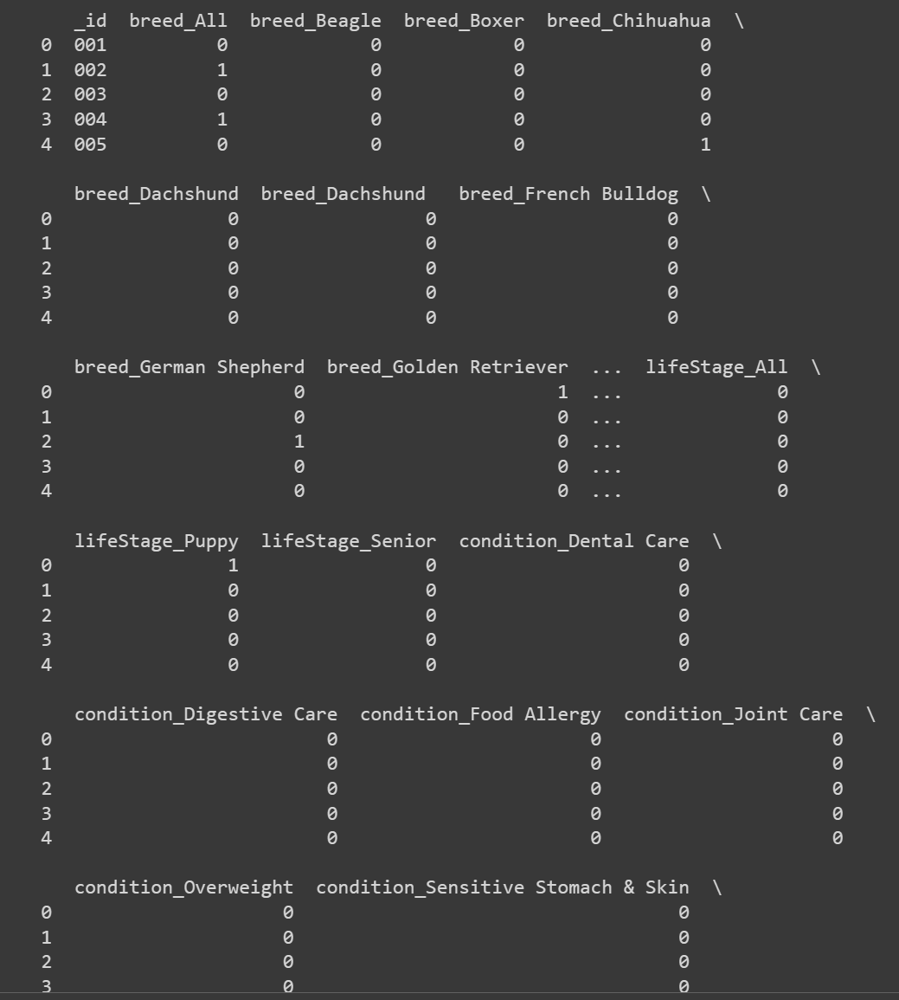

# Feature Enhancements

**Every project can be improved.** As technology professionals, we need to know the time to stop because, in the business world, we are ruled by the project trio: scope, cost and time. This section shows some ideas to improve or place this feature in a real production environment.

## Frontend

1. **Improve responsiveness.** The project is responsive, but it can be improved.

2. **Error component to show a message when the API is down.**

## Backend

1. **Use a real database solution to store the data.** I suggest a NoSQL database because the food objects can change and gain different attributes over time, as it's not a core feature and managing a relational database would consume a lot of time.

2. **Move the endpoint for an existing API.** The solution can stay in a serverless solution. As proof of concept, it achieved the goal, but we can put it inside the existing API project. Maintaining the same codebase, authentication, and deployment process is better.

3. **Change the dataset to use brands and products that Vetster wants to work with.**

4. **Use types to improve API reliability.**

5. **Use a solution to store the encoded data to avoid processing it every time the API is called.**

   > Encoded data is a table organized differently, where the columns are the attributes and the rows are the products. In this data frame, we have only `0` and `1`, where `0` means that the product doesn't have the attribute and `1` means that the product has the attribute. We only need to encode the data when the dataset changes.

   
