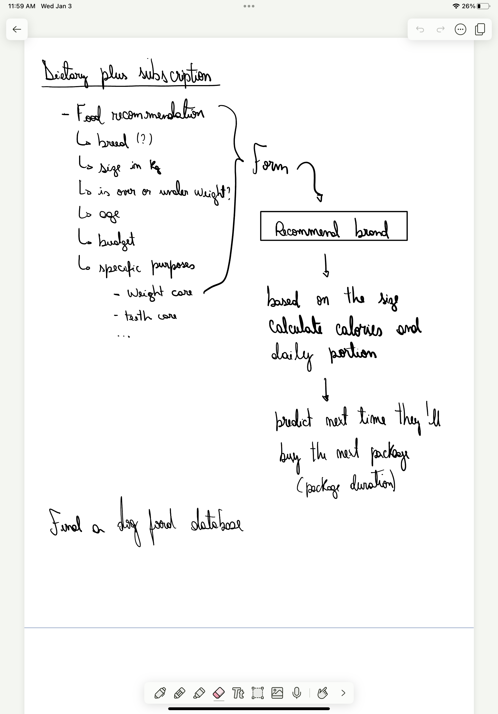
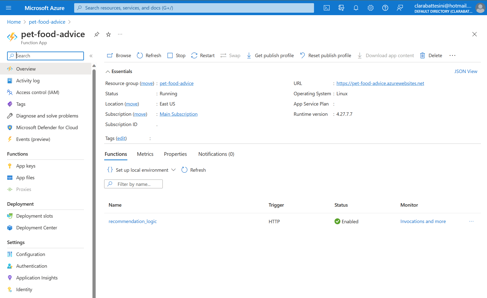
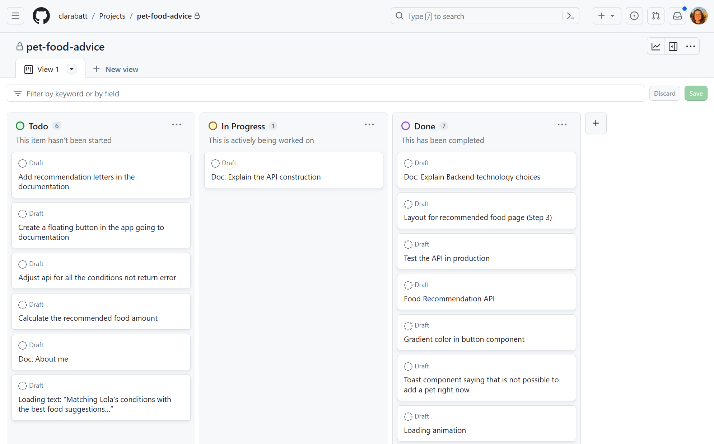

# Ideation Process

## The idea

I set to myself this challenge motivated by a Vetster's job opportunity as a Frontend Engineer. Then, I started to think about the kind of features pet owners would like to have at Vetster's website. This ideation process was based upon my own experience as a pet owner and my difficulties; and how Vetster could help me and others alike.

Finally, I decided to go for something related to food. I drew some sketches on the iPad, because I love to represent ideas in a more organized and visual way, like drawing in the whiteboard, making presentations, using pen and paper, etc.



## Research

When I realized that the feature would be related to food, I started to research Vetster's platform and the kind of information they already have on pets and the technologies they use on the website. More details were gathered using the browser's inspecting tool.

As I had a basic knowledge of how animal feeding process works, because I studied it for Lola's new diet, I didn't need to research much about it. I just needed to get some support materials like a [table of calories per food type/brand](https://www.franklinanimalclinic.vet/sites/site-2382/documents/Dog_Dry_Foods1.pdf) and a list of health conditions that could be used in the feature.

## Design

I started to design the flow in Whimsical, a simple and practical tool that I love to use to draw workflows and wireframes. I used Vetster's website screenshots to guide me in the design process as I wanted to keep it in the same style and colors.


## Development

### Frontend

I started by structuring and setting up the project and installing the dependencies. I used Vue3, Vue Router, Vite, Pinia, VitePress, TailwindCSS, Heroicons and Firebase Hosting, you can check more details in the [Technology Stack](/project-scope.md#technology-stack) section.

With a defined project structure, I started working on the general layout, the sidebar, main menu, and the area where the routes are rendered. I wanted to keep it as real as possible in terms of the working process, so I used a GitHub repository for versioning, committing and pushing the code as I worked on it. [You can check the project's commit history here](https://github.com/clarabatt/pet-food-advice/commits/main/). I even created workflows to deploy the application on Firebase and branches and pull requests to control and organize the code.

I realized that I had to reduce the scope and focus on one species of pet as MVP, **dogs**. I also decided on not delivering features like login, signup, and pet addition.

The next phase was to create the feature UI itself, at least for the first parts of the flow, the pet and the health conditions selection. I created the components and the routes for these two, and the global state management with Pinia, which I was pretty happy with.

> By the way, I loved using Vue3. I'm thinking about using it in my next projects instead of React.
> Pinia is very close to MobX on React, and I like to use it because it keeps things simple.

### Data and Recommendation Algorithm

I started to work on the logic of the feature, the recommendation algorithm. I created a JSON file with the dog food samples:

```json
{
  "_id": "001",
  "name": "Royal Canin® Breed Health Nutrition® Golden Retriever Puppy Dry Dog Food",
  "brand": "Royal Canin",
  "condition": null,
  "packageWeight_kg": 13.6,
  "packageWeight_lb": null,
  "price": 122.99,
  "calories": 447,
  "breed": "Golden Retriever",
  "animalSize": "All",
  "lifeStage": "Puppy",
  "picture": "https://s7d2.scene7.com/is/image/PetSmart/5184508?$CLEARjpg$"
}
```

I tried to find a dataset but didn't find any, so I had to build my own using pet store requisitions as a mining place. I got the samples I used from [PetSmart's website](https://www.petsmart.ca/dog/food/dry-food/authority+blue-buffalo+hills-science-diet+natural-balance+nutrience+purina-pro-plan+royal-canin/?pmin=0.01&srule=best-sellers), making some adjustments for my use. Thank you, PetSmart <3

When I started to think about the algorithm, I felt a decision tree was a perfect solution for this case. I began to think about the priority orders to choose the perfect food match. I drew the questions on my whiteboard to determine how to organize the priority order.


_\* That in the right corner bottom is Lola's weight track._

Once I knew how it would work, I started to code it. I decided to use Python as it has a lot of libraries to help with data manipulation. I used Pandas to manipulate the data and Sklearn to create the decision model. I made a Colab Notebook to test the model and the data manipulation before using it in an API.

When I started my tests, I realized that I didn't have enough data to train the model, and decision trees are the best option when you have more specific rather than general cases. I had only 100 samples, which is a ridiculous amount. Because of the difficulty of finding a dataset, getting more data was not an option. I could try a solution to randomize samples, but I wanted to keep the data as accurate as possible. So, I decided to change the algorithm.

Researching algorithms, I found the **Cosine Similarity**. It determines how similar two items are. This algorithm is largely used in recommendation systems.

[You can check my Google Colab notebook with the tests here](https://colab.research.google.com/drive/1iEG3p1saytlS0wGL7Upbh8W7b5FDvt1t?usp=sharing)


### Backend

I created a simple API using Azure Functions to serve the data and the recommendation algorithm. I used a JSON file as a database, which is not an option for a real production application, but it was enough to show the feature working.

The backend is in a different repository. [You can check the API code here](https://github.com/clarabatt/pet-food-advice-api)



### Integration

I integrated the API with the frontend, using Node's fetch feature to make the requests. I created a service to handle the requests and centralize the API outside the Store.

### Final Touches

Every feature needs some final adjustments before the release. That was the time to make the final touches, like the loading state, the error handling, the responsive layout, and the documentation finishing.

### Organization and Documentation

I did a GitHub project to organize the tasks and track the project's progress.



To achieve all my intentions with the project and document every step taken, I created documentation using VitePress to write this case study.
